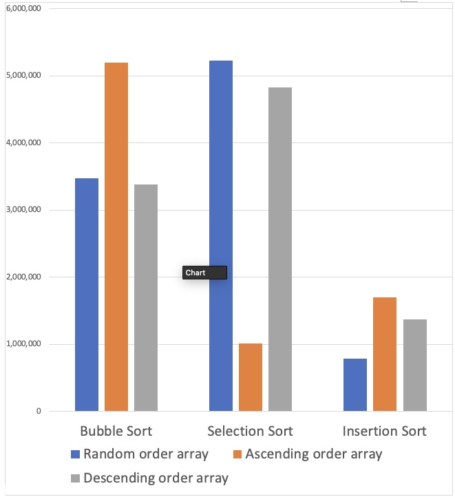

# algo_asm1

CSD201x_02
ASM 1
Hồ Nhật Minh | FX03283

A.	NHẬN XÉT KẾT QUẢ SO SÁNH THỜI GIAN THỰC THI 3 THUẬT TOÁN SẮP XẾP: BUBBLE SORT, SELECTION SORT VÀ INSERTION SORT

1.	Môi trường khảo sát
Phần cứng:
Máy tính: Macbook Pro
CPU: Apple M1
RAM: 16 GB

Phần mềm:
OS: macOS Monterey 12.0.1
IDE: IntelliJ IDEA 2021.2.2 (Ultimate Edition)
JDK: 11

Thời gian thực hiện khảo sát: 10/11/2021

2.	Cách thức triển khai khảo sát
Đo thời gian thực thi lần lược 3 thuật toán sắp xếp là (1) Bubble Sort, (2) Selection Sort và (3) Insertion sort. Cách thức thực thi sắp xếp: tăng dần.
Mảng dùng để khảo sát:
-	Độ lớn: 30
-	Giá trị mảng: [-94, 43, 38, 42, -21, 39, 42, -98, 84, 24, 94, 26, 31, -26, 134, -73, 938, 93, 33, 74, -20, 84, 922, 824, -23, 58, 37, 859, 28, -64]
-	Khảo sát trong 3 điều kiện như nhau cho 3 thuật toán, thực hiện 03 lần lập lại cho mỗi quan sát.
-	 Sau đó so sánh giá trị trung bình của các lần lập lại. Các điều kiện khảo sát:
o	Random order array: Mảng sắp xếp ngẫu nhiên (như trên)
o	Ascending order array: Mảng đã được sắp xếp tăng dần.
o	Descending order array: Mảng đã được sắp xếp giảm dần.
3.	Kết quả khảo sát
-	Số liệu chi tiết: xem file Excel đính kèm.
-	Biểu đồ:
 

Dựa trên biểu đồ, ta có những nhận xét sau:
(1)	Thuật toán Bubble sort có thời gian thực thi đối với mảng sắp xếp ngẫu nhiên và mảng sắp xếp giảm dần là gần bằng nhau, tuy nhiên có sự chênh lệch khoảng 49% giữa mảng sắp xếp tăng dần so với hai loại mảng còn lại.
(2)	Thuật toán Selection Sort có thời gian sắp xếp hiệu quả đáng kể trên mảng có sắp xếp tăng dần so với mảng có sắp xếp ngẫu nhiên (81%) và giảm dần (79%).
(3)	Thuật toán Insertion Sort có thời gian sắp xếp đối với mảng ngẫu nhiên là thấp nhất, chênh lệch là 54% với mảng sắp xếp tăng dần và 43% với mảng giảm dần.
(4)	Đối với cả 3 loại mảng thì thời gian tối ưu nhất thuộc về thuật toán sắp xếp, khi vượt trội hơn 2 thuật toán còn lại. Cụ thể
a.	Đối với mảng ngẫu nhiên: thấp hơn bubble sort là 77%, thấp hơn selection sort là 85%.
b.	Đối với mảng tăng dần: thấp hơn bubble sort là 67%, tuy nhiên cao hơn thuật toán insertion sort là 69%.
c.	Đối với mảng giảm dần: thấp hơn bubble sort là 59%, thấp hơn thuật toán selection sort là 72%.

4.	Kết luận
Đối với cỡ mẫu 30 và chạy trên máy tính Macbook pro M1 ram 16GB thì thuật toán Insertion sort thể hiện sự tối ưu vượt trội hơn hai thuật toán còn lại. Tuy nhiên đối với mảng tăng dần thì thuật toán Selection Sort lại thể hiện tối ưu hơn 2 thuật toán còn lại. Thuật toán Bubble sort thể hiện tốt hơn Selection sort ở mảng ngẫu nhiên và mảng giảm dần tuy nhiên thua xa Insertion sort ở hạng mục này.

B.	GIẢI THÍCH KẾT QUẢ & PHÂN TÍCH CÔNG THỨC ĐỘ PHỨC TẠP
1.	Thuận toán Bubble Sort
-	Worst case: O(n2): khi ta sắp xếp một mảng đã được sắp xếp theo chiều ngược lại. Điều này giải thích tại sao thời gian sắp xếp đối với mảng tăng dần là lớn nhất. Vì thuật toán sắp xếp tác giả cho chạy vòng lập từ phần tử cuối mảng trở về đầu, nên rơi vào tình huống worst case.
-	Best case O(n): khi mảng đã được sắp xếp theo đúng chiều. Do đó thời gian thực thi trên mảng giảm dần là thấp nhất.
2.	Thuật toán Selection Sort
-	Worst case: O(n2): xuất hiện đối với mảng có chiều ngược lại. Điều này lý giải vì sao thời gian sắp xếp mảng giảm dần là cao so với thời gian sắp xếp mảng tăng dần. Vì tác giả dùng vòng lập từ index 0 trở lên.
-	Best case: O(n): đối với mảng đã được sắp xếp đúng chiều. Điều này giúp cho việc sắp xếp trên mảng tăng dần được tối ưu thời gian.
3.	Thuật toán Insertion Sort:
-	Worst case O(n2): khi sắp xếp lại một mảng đã được sắp xếp chiều ngược lại. 
-	Best case O(n): khi sắp xếp một mảng đã được sắp xếp sẵn.
Ta thấy kết quả thực sự không giống như vậy, tuy nhiên khác biệt giữa 2 kết quả này là tương đối thấp (19%). Đây là do không có khác biệt lớn từ việc cỡ mẫu nhỏ (30) và số lần lập lại chưa cao (3 lần) nên chưa thể hiện thật sự được bản chất của thuật toán.
4.	Sự tối ưu của Insertion sort
Bản chất của Insertion sort giúp giảm số lần hoán vị giữa mỗi công đoạn, do đó thời gian thực thi của Insertion thấp hơn rất nhiều so với Bubble sort và Selection sort.

